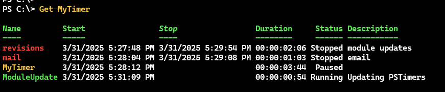

# PSTimers

[](https://www.powershellgallery.com/packages/PSTimers/) [](https://www.powershellgallery.com/packages/PSTimers/)

A set of PowerShell functions to be used as timers and countdown tools.

This module is available from the PowerShell Gallery and should install in Windows PowerShell 5.1 and PowerShell 7.

```powershell
Install-PSResource PSTimers
```

> Installing the module will also install the `Microsoft.PowerShell.ThreadJob` module if it isn't already installed. If you attempt to install the module with `Install-Module` and you have the legacy `ThreadJob` module installed, you might get a warning message. If this happens, run `Install-Module PSTimers -AllowClobber`. This error doesn't seem to happen when using `Install-PSResource`.

The commands should also work on PowerShell 7 cross-platform except for those that utilize WPF. It is recommended that you run PowerShell 7.2 or later on non-Windows systems. This module incorporates commands from a previous module that creates simple timer objects.

| Name                     | Alias           | Synopsis                                                   |
|--------------------------|-----------------|-----------------------------------------------------------|
| [Export-MyTimer](docs/Export-MyTimer.md)   |                   | Export a timer object to an XML file.                     |
| [Get-HistoryRuntime](docs/Get-HistoryRuntime.md) | *ghr*           | Get a history runtime object.                             |
| [Get-MyTimer](docs/Get-MyTimer.md)         |                   | Get the current status of a simple timer.                 |
| [Import-MyTimer](docs/Import-MyTimer.md)   |                   | Import a timer variable from an XML file.                 |
| [Remove-MyTimer](docs/Remove-MyTimer.md)   |                   | Remove a MyTimer object.                                  |
| [Reset-MyTimer](docs/Reset-MyTimer.md)     |                   | Reset a MyTimer object.                                   |
| [Restart-MyTimer](docs/Restart-MyTimer.md) |                   | Restart a MyTimer object.                                 |
| [Resume-MyTimer](docs/Resume-MyTimer.md)   |                   | Resume a paused MyTimer object.                          |
| [Set-MyTimer](docs/Set-MyTimer.md)         |                   | Modify a MyTimer object.                                  |
| [Start-MyTimer](docs/Start-MyTimer.md)     | *ton*             | Start a simple timer.                                     |
| [Start-PSCountdown](docs/Start-PSCountdown.md) | *spsc*         | Start a graphical countdown display using Write-Progress. |
| [Start-PSCountdownTimer](docs/Start-PSCountdownTimer.md) | | Start a WPF-based countdown timer.                       |
| [Start-PSTimer](docs/Start-PSTimer.md)     | *spst*            | Initiates a countdown before running a command.           |
| [Start-PSCountdownTitle](docs/Start-PSCountdownTitle.md) | *TitleCountdown*  | Start a countdown timer in the console title. |
| [Stop-MyTimer](docs/Stop-MyTimer.md)       | *toff*            | Stop your simple timer.                                   |
| [Stop-PSCountdownTimer](docs/Stop-PSCountdownTimer.md) | | Stop a Countdown Timer.                                  |
| [Suspend-MyTimer](docs/Suspend-MyTimer.md) | *Pause-MyTimer*   | Pause a MyTimer object.                                   |

## :book: History Runtime

PowerShell 7 will display how long a command took to complete when using `Get-History`. [Get-HistoryRuntime](docs/Get-HistoryRuntime.md) will provide the same functionality in Windows PowerShell. By default, it gets the runtime of the last history item.

```powershell
PS C:\> $s = dir c:\scripts
PS C:\> Get-HistoryRuntime

 ID RunTime
 -- -------
292 00:00:00.2392380
```

The command has an alias of `ghr` and you can specify any history item.

```powershell
PS C:\> ghr 295 -Detail

 ID RunTime             Status Command
 -- -------             ------ -------
295 00:00:07.7998983 Completed get-winevent system -MaxEvents 1000
```

## :watch: MyTimer

:skull: _The MyTimer class and related commands have been heavily revised and extended. There are several breaking changes from previous versions of this module. It is recommended that you clear existing timers before upgrading and using this version of the module._

The `MyTimer` object is defined in a private PowerShell class.

```powershell
   TypeName: MyTimer

Name            MemberType  Definition
----            ----------  ----------
Equals          Method      bool Equals(System.Object obj)
GetCurrentTimer Method      MyTimer GetCurrentTimer()
GetHashCode     Method      int GetHashCode()
GetStatus       Method      timespan GetStatus()
GetType         Method      type GetType()
PauseTimer      Method      void PauseTimer()
Refresh         Method      void Refresh()
ResetTimer      Method      void ResetTimer()
RestartTimer    Method      void RestartTimer()
ResumeTimer     Method      void ResumeTimer()
StartTimer      Method      void StartTimer()
StopTimer       Method      void StopTimer()
ToString        Method      string ToString()
Description     Property    string Description {get;set;}
Duration        Property    timespan Duration {get;set;}
End             Property    datetime End {get;set;}
Name            Property    string Name {get;set;}
Running         Property    bool Running {get;set;}
Start           Property    datetime Start {get;set;}
Status          Property    MyTimerStatus Status {get;set;}
History         PropertySet History {Name, Start, End, Duration, Description}
```

Many of the methods are called from related commands.

You can create a new timer from the prompt.

```powershell
PS C:\> Start-MyTimer revisions -Description "module updates"

Name      Start                Stop Duration     Status Description
----      -----                ---- --------     ------ -----------
revisions 3/31/2025 5:27:48 PM      00:00:00:00 Running module updates
```

You can start as many timers as you need.

```powershell
PS C:\> $a = Start-MyTimer mail -Description email
PS C:\> $b = Start-MyTimer
```

Use `Get-MyTimer` to view.

```powershell
PS C:\> Get-MyTimer

Name      Start                Stop Duration     Status Description
----      -----                ---- --------     ------ -----------
revisions 3/31/2025 5:27:48 PM      00:00:00:36 Running module updates
mail      3/31/2025 5:28:04 PM      00:00:00:20 Running email
MyTimer   3/31/2025 5:28:12 PM      00:00:00:12 Running
```

When you are finished, you can stop the timer.

```powershell
PS C:\> Stop-MyTimer mail -PassThru | Format-List

Name        : mail
Start       : 3/31/2025 5:28:04 PM
End         : 3/31/2025 5:29:08 PM
Duration    : 00:01:03.8458479
Running     : False
Description : email
Status      : Stopped
```

The timer will exist for the duration of your PowerShell session.

```powershell
PS C:\> Get-MyTimer -Status Stopped | Select History

Name        : revisions
Start       : 3/31/2025 5:27:48 PM
End         : 3/31/2025 5:29:54 PM
Duration    : 00:02:06.5184936
Description : module updates

Name        : mail
Start       : 3/31/2025 5:28:04 PM
End         : 3/31/2025 5:29:08 PM
Duration    : 00:01:03.8458479
Description : email
```

Although there are provisions for exporting and importing timers.

The module includes a format ps1xml file that uses ANSI to highlight timers based on status.



Timers are managed through two hashtables created as global variables, `$MyTimerCollection` and `$MyWatchCollection`. Do not delete these variables. The MyTimer commands will update these hashtables as needed.

## :rocket: Start-PSCountdown

The [Start-PSCountdown](docs/Start-PSCountdown.md) command uses `Write-Progress` to display countdown information. PowerShell 7.2 uses a minimized progress display and a different set of color options based on `$PSStyle`.


If you would like to use the legacy progress display in PowerShell 7, you should configure it before running `Start-PSCountdown`.

```powershell
$PSStyle.View = "Classic"
```

Set it to `Minimal` to restore.

`Start-PSCountdown` will automatically detect `$PSStyle` and adjust colors accordingly. It is recommended that you use PowerShell 7.2 or later.

Use `Ctrl+C` to terminate a countdown.

## :computer: Start-PSTimer

For a more traditional countdown timer, you can use [Start-PSTimer](docs/Start-PSTimer.md). This is an ideal command when you have a simple countdown, say, from 10. You can invoke a script block at the countdown completion.

```powershell
PS C:\> Start-PSTimer  -ScriptBlock {Get-Date} -Message "Let's Do This Thing!" -Title "Get-Ready"
```

## Title Timer

Another timer option is to display it in the console title bar. Although for most people, this will mean the profile tab in Windows Terminal. You can use [`Start-PSCountdownTitle`](docs/Start-PSCountdownTitle.md) to display a countdown timer in the console title bar. It will __not__ work in the PowerShell ISE or VS Code.

Specify the timer in seconds. You can optionally specify a short message to display in the title bar and a short message to display after the countdown finishes.

```powershell
Start-PSCountdownTitle -Seconds 120 -CountdownText "Resuming in"
```


By default, the original tab title will be restored after 10 seconds. But you can configure this with the `-Wait` parameter. Set it to `-1` to leave the title as is after the countdown completes.

## WPF-Based Timers

If you are running a Windows-platform, you can use a WPF-based countdown timer.

### :alarm_clock: PSCountdownTimer

An alternative to `Start-PSCountdown` is [Start-PSCountdownTimer](docs/Start-PSCountdownTimer.md) and related [Stop-PSCountdownTimer](docs/Stop-PSCountdownTimer.md)

```powershell
$splat = @{
    Seconds  = 600
    Message  = 'The PowerShell magic begins in '
    FontSize = 64
    Color    = 'SpringGreen'
    OnTop    = $True
}
Start-PSCountdownTimer @splat
```


This is a transparent WPF form that displays a countdown timer and an optional message. You can control it by changing values in the `$PSCountdownClock` synchronized hashtable.

```powershell
PS C:\> $PSCountdownClock

Name                           Value
----                           -----
OnTop                          True
RunSpace                       System.Management.Automation.Runspaces.LocalRunspace
StartingPosition
Color                          SpringGreen
WarningColor                   Red
FontFamily                     Segoi UI
Warning                        30
Started                        3/31/2025 5:36:56 PM
FontWeight                     Normal
Action
AlertColor                     Yellow
Seconds                        600
CurrentPosition                {1334, 532}
FontSize                       64
Message                        The PowerShell magic begins in
FontStyle                      Normal
Running                        True
Alert                          50

PS C:\> $PSCountdownClock.OnTop = $False
```

At 50 seconds the color will change to yellow and then to red at 30 seconds.

You can stop the clock by right-clicking on the form, setting the `Running` hashtable value to `$False`, or running `Stop-PSCountdownTimer`. This is the recommended way. The WPF countdown runs in a separate runspace. If you close the PowerShell session where you started the countdown, the timer will terminate.

Because the timer runs in a separate runspace, the timer itself cannot initiate an action at the end of the timer. If you would like to create automation around the countdown timer, you could create a PowerShell script like this. The sample requires a Windows platform.

```powershell
Clear-Host
$splat = @{
    Seconds  = 600
    Message  = 'The PowerShell magic begins in '
    FontSize = 64
    Color    = 'SpringGreen'
    OnTop    = $True
}
Start-PSCountdownTimer @splat
Do {
    Start-Sleep -Seconds 1
} While ($PSCountdownClock.Running)
Write-Host "Are you ready for some PowerShell?" -ForegroundColor magenta -BackgroundColor gray

#play a startup song
Add-Type -AssemblyName PresentationCore
$filename = "c:\work\01-Start.mp3"

$global:MediaPlayer = New-Object System.Windows.Media.MediaPlayer
$global:MediaPlayer.Open($filename)
$global:MediaPlayer.Play()

#the media player launches with no UI. Use the object's methods to control it.
# MediaPlayer.stop()
# $MediaPlayer.close()
```

## :hammer: Related Tools

For a related project, take a look at the [PSClock](https://github.com/jdhitsolutions/PSClock) module. Or if you need a simple to-do manager, look at the [PSWorkItem](https://github.com/jdhitsolutions/PSWorkItem) module.
