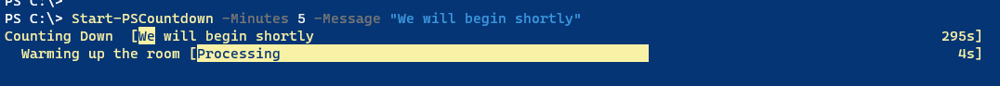

# PSTimers

[](https://www.powershellgallery.com/packages/PSTimers/) [](https://www.powershellgallery.com/packages/PSTimers/)

A set of PowerShell functions to be used as timers and countdown tools.

This module is available from the PowerShell Gallery.

```powershell
Install-Module PSTimers
```

I use several of these tools on a regular basis.

* [Export-MyTimer](Docs/Export-MyTimer.md)
* [Get-HistoryRuntime](Docs/Get-HistoryRuntime.md)
* [Get-MyTimer](Docs/Get-MyTimer.md)
* [Import-MyTimer](Docs/Import-MyTimer.md)
* [Remove-MyTimer](Docs/Remove-MyTimer.md)
* [Set-MyTimer](Docs/Set-MyTimer.md)
* [Start-MyTimer](Docs/Start-MyTimer.md)
* [Start-PSCountdown](Docs/Start-PSCountdown.md)
* [Start-PSCountdownTimer](Docs/Start-PSCountdownTimer.md)
* [Stop-PSCountdownTimer](Docs/Stop-PSCountdownTimer.md)
* [Start-PSTimer](Docs/Start-PSTimer.md)
* [Stop-MyTimer](Docs/Stop-MyTimer.md)

The commands should also work on PowerShell 7 cross-platform, although there may be a few artifacts on non-Windows systems. It is recommended that you run PowerShell 7.2 or later on non-Windows systems.

## PowerShell 7

The `Start-PSCountdown` command uses `Write-Progress` to display countdown information. PowerShell 7.2 uses a minimized progress display and a different set of color options based on `$PSStyle`.



If you would like to use the legacy progress display in PowerShell 7, you should configure it before running `Start-PSCountdown`.

```powershell
$PSStyle.View = "Classic"
```

Set it to `Minimal` to restore.

`Start-PSCountdown` will automatically detect `$PSStyle` and adjust colors accordingly. It is recommended that you use PowerShell 7.2 or later.

## PSCountdownTimer

An alternative to `Start-PSCountdown` is [`Start-PSCountdowntimer`](Docs/Start-PSCountdownTimer.md).

```powershell
Start-PSCountdownTimer -seconds 600 -message "The PowerShell magic begins in " -FontSize 64 -Color SpringGreen -OnTop
```


This is a transparent WPF form that displays a countdown timer and optional message. You can control it by changing values in the `$PSCountdownclock` synchronized hashtable.

```powershell
PS C:\> $pscountdownclock

Name                           Value
----                           -----
StartingPosition
Running                        True
Seconds                        600
Color                          SpringGreen
FontWeight                     Normal
FontFamily                     Segoi UI
CurrentPosition                {1334, 532}
OnTop                          True
Runspace                       System.Management.Automation.Runspaces.LocalRunspace
Message                        The PowerShell magic begins in
FontStyle                      Normal
Started                        10/14/2022 4:21:13 PM
FontSize                       64
AlertColor                     Yellow
WarningColor                   Red
Alert                          50
Warning                        30

PS C:\> $pscountdownclock.OnTop = $False
```

At 50 seconds the color will change to yellow and then to red at 30 seconds.

You can stop the clock by right-clicking on the form, setting the `Running` hashtable value to `$False` or run `Stop-PSCountdownTimer`. This is the recommended way. The WPF countdown runs in a separate runspace. If you close the PowerShell session where you started the countdown, the timer will terminate.

Because the timer runs in a separate runspace, the timer itself cannot initiate an action at the end of timer. If you would like to create automation around the countdown timer, you could create a PowerShell script like this.

```powershell
Start-PSCountdownTimer -seconds 60 -message "The PowerShell magic begins in " -FontSize 64 -Color SpringGreen
Do {
    Start-Sleep -Seconds 1
} While ($PScountdownclock.Running)
Clear-Host
Write-Host "Are you ready for some PowerShell?" -ForegroundColor magenta -BackgroundColor gray

#play a startup song
Add-Type –AssemblyName PresentationCore
$filename = "c:\work\01-Start.mp3"

$global:mediaplayer = New-Object system.windows.media.mediaplayer
$global:mediaplayer.Open($filename)
$global:mediaplayer.Play()

#the media player launches with no UI. Use the object's methods to control it.
# mediaplayer.stop()
# $mediaplayer.close()
```

## Related Tools

For a related project, take a look at the [PSClock](https://github.com/jdhitsolutions/PSClock) module.
